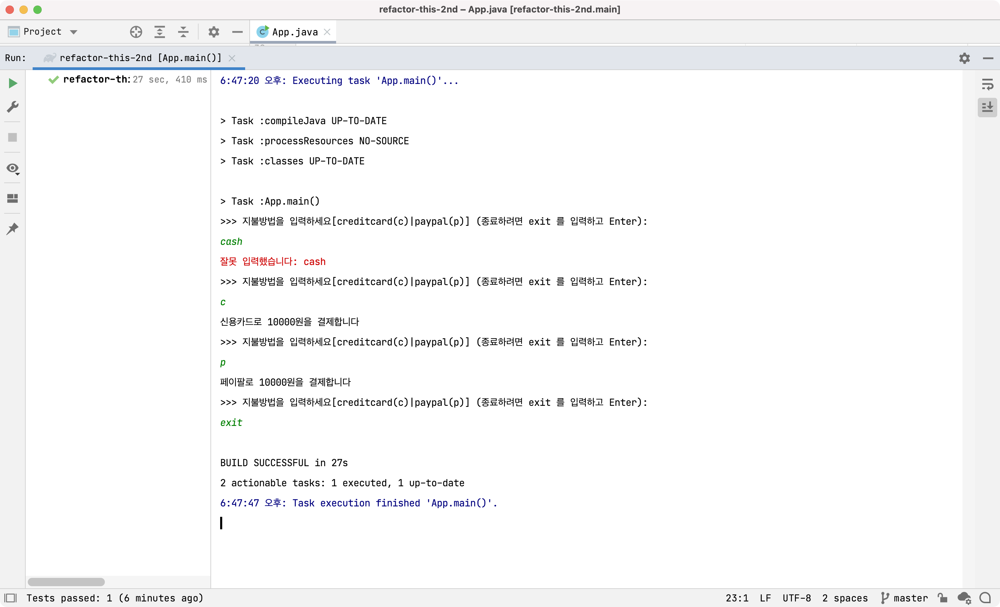
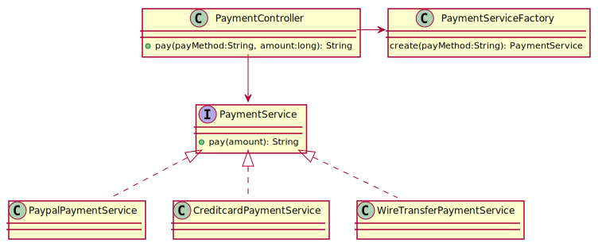

## 설계

- `App.java` 흐름을 제어한다; 사용자 입력을 받고 처리 결과를 출력한다
- `PaymentController.java` 사용자 입력을 서비스에 위임하한다
- `PaymentService.java` 사용자가 입력한 지불 방법에 따라 결제를 처리한다

## Q1: Refactoring

주어진 코드를 리팩토링하라 (힌트: SOLID)

## Q2: Feature

계좌 이체 지불방법이 추가되었다. 구현하라

## Q3: Feature

고객들이 Paypal과 계좌에 대한 잔액 조회 기능을 요구하고 있다(Creditcard는 잔액 개념이 없다). 서비스 메서드를 구현하라(화면 출력은 생략)

## Solution

